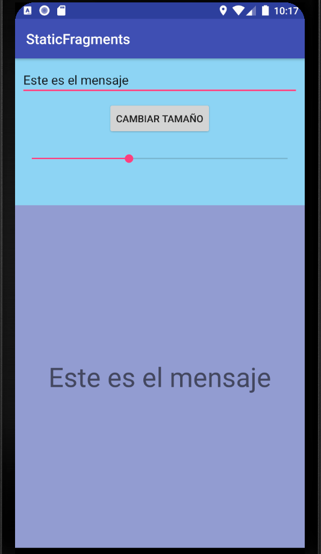

# Ejercicio Static Fragment
El objetivo principal de este ejercicio es mostrar cómo crear fragmentos estáticos mediante la etiqueta XML `<fragment>`  
y el atributo `android:name` que contiene el nombre de la clase Java que hereda de `Fragment`. Este fragmento no podrá reemplazarse
ni eliminarse por otro fragmento en tiempo de compilación y se mostrará siempre en el espacio o posición inicial.
Teniendo en cuenta el código XML de nuestra aplicación:
``` java
<?xml version="1.0" encoding="utf-8"?>
<LinearLayout xmlns:android="http://schemas.android.com/apk/res/android"
    xmlns:tools="http://schemas.android.com/tools"
    android:layout_width="match_parent"
    android:layout_height="match_parent"
    tools:context="com.example.staticfragments.MainActivity"
    android:orientation="vertical">
    <fragment
        android:layout_width="match_parent"
        android:layout_height="0dp"
        android:layout_weight="0.3"
        android:id="@+id/fragmenta"
        tools:layout="@layout/fragmenta"
        android:name="com.example.staticfragments.FragmentA" />

    <fragment
        android:id="@+id/fragmentb"
        android:name="com.example.staticfragments.FragmentB"
        android:layout_width="match_parent"
        tools:layout="@layout/fragmentb"
        android:layout_height="0dp"
        android:layout_weight="0.7" />
</LinearLayout>
```
Se muestra dos fragmentos: el fragmento A ocupa el 30% de la pantalla y el fragmento B ocupa el 70%:



En el caso que la orientación sea horizontal se reinicia la Activity y se muestran tres Fragment:
``` java
<?xml version="1.0" encoding="utf-8"?>
<LinearLayout xmlns:android="http://schemas.android.com/apk/res/android"
    xmlns:app="http://schemas.android.com/apk/res-auto"
    xmlns:tools="http://schemas.android.com/tools"
    android:layout_width="match_parent"
    android:layout_height="match_parent"
    tools:context="com.example.staticfragments.MainActivity"
    android:orientation="horizontal">

    <fragment
        android:id="@+id/fragmenta"
        android:name="com.example.staticfragments.FragmentA"
        android:layout_width="0dp"
        android:layout_height="match_parent"
        tools:layout="@layout/fragmenta"
        android:layout_weight="0.3" />

    <fragment
        android:id="@+id/fragmentb"
        android:name="com.example.staticfragments.FragmentB"
        android:layout_width="0dp"
        android:layout_height="match_parent"
        tools:layout="@layout/fragmentb"
        android:layout_weight="0.3" />

    <fragment
        android:id="@+id/fragmentc"
        android:name="com.example.staticfragments.FragmentC"
        android:layout_width="0dp"
        android:layout_height="match_parent"
        tools:layout="@layout/fragmentc"
        android:layout_weight="0.4" />
</LinearLayout>

```

